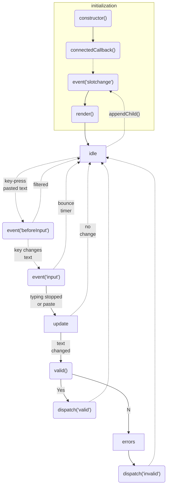

# Section-Field 
### Web Component

This custom web component is a composite-control around a main TextArea with additional validation functionality.

The control operates as a regular TextArea with the addition of a validation function that evaluates the input and displays evaluation errors in an expanding error box.
Additionally there is an optional label and an optional container to hold user-supplied controls.

<br>  

## Contents  
[Workflow](#workflow)  
[Instantiation](#instantiation)  
[Customization](#customize)    
[Events](#events)  
[Properties](#properties)  
[Attributes](#attributes-html)  
[Event Flow](#event-flow)  


<br><br>
## Workflow
1. Instantiate control
2. Customize style, label, and pattern
2. Optionally add child element(s) 
3. Optionally assign validation function
4. Subscribe to `valid` event and optionally, `invalid` event


<br><br>
## Instantiation
How to create new instances of this control  

```html
<!-- include the control in HTML -->
<head>
    <script src='section-field.js' [type='module']></script>
</head>
```

```html
<!-- create in HTML -->
<section-field></section-field>
```


```js
// create with JavaScript
const field = document.createElement('section-field');
<some-element>.appendChild(field);
```

<br><br>
## Customize
Customized the appearance and functionality of this control  

### __nested elements__
```html
<!-- add nested element(s) for additional control/context -->
<section-field>
    <div>
        <label>Press Me</label>
        <input type='button'>Button</input>
    </div>
</section-field>
```
> __Note:__ This control will not style the nested element

### __show/hide label__
```html
<!-- show the label (hidden by default) -->
<section-field label></section-field>
```
```js
field.label = true
```

### __style__

```html
<!-- The control's style is encapsulated with a shadow-dom. 
     However, some css styles can be defined in the 'light-dom' -->
<style>
    section-field {
         
            background: rgb(215, 231, 240);

            --label-background: rgb(80, 100, 80);
            --notice-background: rgb(134, 162, 189); 

            font-family: Impact, Haettenschweiler, 'Arial Narrow Bold', sans-serif;
            color: aqua;
        
    }
</style>
```


<br><br>
## Properties
Properties accessible through JavaScript

### `value` _(the current text)_
```js
// get value
const value = field.value;

// set value (this will trigger the 'valid' function)
field.value = 'new text';
```

### `valid` (gets validity status / sets validation function)
```js
// get the fields validation status (calls validation function)
const isValid = field.valid;

// set validation function 
field.valid = (field) => {
    return /^[0-9]*$/.test(field.value);
}
```
>Note: the `valid()` function will get called immediately upon setting


### `label` 
```js
// get: the label's visibility status
const labelVisible = field.label;

// set: show or hide the label
field.label = true;
```

### `notice` 
```js
// get: the notice's visibility status
const noticeVisible = field.notice;

// set: show or hide the notice (error area)
field.notice = true;
```

### `placeholder` 
```js
// get the current placeholder/label text 
const value = field.placeholder;

// set: sets the placeholder/label text 
field.placeholder = 'First Name'
```

### `errors` 
```js
// get: array of current error objects (empty array if none)
const errors = field.errors;

// set: sets the errors as an array, replacing the existing set
field.errors = [{message: 'Invalid value', code: 100, level: 3}];
field.errors = ['Invalid value'];  // a string will get converted to a default error object (equivalent to above)
field.errors = field.errors.concat(['Invalid value']); // add to existing errors
field.errors = []; // clear the error set
```

### `index`
```js
// this fields index when contained in a Section web component
const index = field.index;
```

### `readonly`
```js
// set: when true, the text data cannot be altered by the user
field.readonly = true;
```

### `disabled`
```js
// set: when true, the control cannot be iterated with
field.disabled = true;
```

### `pattern`
```js
// get: the current pattern (undefined if no pattern applied)
const pattern = field.pattern;

// set: pattern regex as a string or regex. Input will be limited to these characters
field.pattern = '^[A-Z]*$'
field.pattern = /^[A-Z]*$/
```

<br><br>
## Attributes
Attributes modifiable through HTML

### `label` 
```html
<!-- shows the optional label text over the input area 
     the label text is the same as the 'placeholder' attribute/property -->
<section-field label/><section-field>
```

### `notice` 
```html
<!-- shows/hides the error-area below the text area
     this section is normally collapsed until there are errors -->
<section-field notice/><section-field>
```

### `placeholder` 
```html
<!-- the input-area placeholder or optional label text -->
<section-field placeholder="Last Name"/><section-field>
```


### `readonly` 
```html
<!-- prevent text from being manually edited -->
<section-field readonly/><section-field>
```

### `disabled` 
```html
<!-- the control will be visible, but fully disabled -->
<section-field disabled/><section-field>
```

### `pattern` 
```html
<!-- regular expression to limit input into the field -->
<section-field pattern="^[a-zA-Z0-9-_]*$"/><section-field>
```


<br><br>
## Methods

### `clear()` _(removes text and errors resetting the control)_
```js
field.clear();
```

<br><br>
## Events

### `input`  _(when text entered into field)_
```js
field.attachEventListener('input', (field)=>{ /* do stuff*/ })
```

### `change` _(when text changed and loses focus)_
```js
field.attachEventListener('change', (field)=>{ /* do stuff*/ })
```

### `valid` _(when text changed and passes validation)_
```js
field.attachEventListener('valid', (field)=>{ /* do stuff*/ })
```

### `invalid` _(when text changed and fails validation)_
```js
field.attachEventListener('invalid', (field)=>{ /* do stuff*/ })
```

<br><br>
## Event Flow

The flow and control of functions and events.  
Solid lines denote direct function calls while dotted-lines denote the flow progressing though an event.  




<br><br>
## Initialization Order
The ordering of initialization events and what artifacts are available for processing varies with instantiation methods.

We have three artifacts to handle for initialization:
1) attributes defined on the html tag
2) child html tags
3) computed css styles

### html instantiation

1) observedAttributes()
2) customElements.whenDefined('my-custom-element')
3) constructor()
4) attributeChangedCallback()
   - html __attributes__ available  

        __Note__: _CSS style values (height, etc) will not yet be available. So any computed styles will have to be deferred to `connectedCallback()` or later_
5) mutationObserver.attributes()  

6) connectedCallback()
   - `getComputedStyle` available  

      __Note__: `connectedCallback()` can be called again if this control was to moved within the DOM. So you'll have to guard operations that you require happen only once.

7) mutationObserver.children()
   - __child elements__ available  

        __Note__: _you may receive this event for each child without any tracking of what children have been handled. You will have to do your own bookkeeping if you want to handle children here. Wait until `slotChange` to get all children at once._

        __Note__: children may be modified at anytime, so don't expect this event to always be here
8) slotChange()
9) resizeObserver()
10) setTimeout()


## Handling

1) __Child elements__ are available last and can happen dynamically over the lifespan of the component. Handling of children with a mutationObserver or slotChange will ensure a fully initialized component.

2) __Computed styles__ can occur in `connectedCallback` or later. If the addition of children (happens later) or the values of attributes (happens earlier) 

3) __Attributes__ : 

## Attribute Reflection


To keep attributes and properties in sync we use a setter/getter on the component that updates the attribute value on set and reads the attribute on get.  Therefore, the attribute stores the actual property value.  Another method is to have a private property value that is updated/read by both the properties and attributes.

1) Keep component values on the attribute
    - all property/attribute side-effects happen in `attributeChangedCallback` to avoid circular updates.  Property setter/getter only updates/reads the attribute without any other side-effects
    - default property values will need to be transferred to attributes during initialization
    - `attributeChangedCallback` may be called before children are available and before the competent is rendered.  Any rendering side-effects will need to be deferred until the component is ready for rendering.

2) Keep internal property values
    - same as above, but attribute handler needs to check update against internal property to determine if the property update was 

   Since the property setter will update the attribute, the `attributeChangedCallback` will then fire and we can do any processing we need here.  If we did the processing in our property setter, then we'd be forced the call the setter from `attributeChangedCallback` and get a loop as the setter would then trigger another `attributeChangedCallback`.  So if we only do our processing in `attributeChangedCallback` we avoid these loops.
   Note: initial attribute changes may want to 

<br>  

## Errors
- Setting `.errors` will resize the 'notify' textarea  
- Errors can be set in the user defined .valid() function or by 
the field.errors setter  
- the `.valid()` function may set errors when invalid, but may not clear them if valid  


When do we resize the notice area?
- when setting error
    - clear: `errors = []`  
    - append: `errors = errors.concat([new error])`
    - add/new `errors = [new error]`
    - warn `errors = [{message, code, level: 2}]`

- after validation.
    - we cannot assume the user will clear `errors` on a positive validation
    - fail: errors = []
    - fail: errors = [new error]
    - fail: errors = [warning]
    - success: errors = []
    - success: 

    if `valid()` === false, don't do anything - `error` should have been set to the required values

    if `valid()` === true, clear errors (not warnings)


    __Should we clear errors before every `valid` call?__
    - it would ensure the error state is correct after the call
    - is there any scenario where we would preserve existing errors?


The Notice area resizes when #expand is called.  Currently it #expand assumes it is expanding from a closed (height=0px) position.

If the user supplies the 'notice' attribute, we leave notice displayed

Notice will get resized when .errors is set - or - the notice attribute is set
Notice will be collapsed when no errors

The notice attribute sets the min height for the notice-div


no-errors ---> errors       0px ---> new-height  
errors    ---> no-errors  
errors    ---> more-errors  
errors    ---> less-errors  
errors    ---> same-errors  


valid
- we want to clear all the errors before valid because we expect the user to set new errors, but do not expect them to clear existing errors
- for the notice-transition 


valid() {

  errors = [];

  isValid = valid();

  if(...) {
    errors = [...]
    return false;
  }

  return true;


}